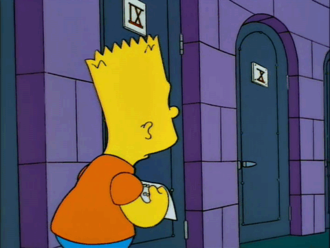

# Ejercicios y ejemplos de JS para los alumnos del 2026

Algunos ejercicios resueltos.

- [00-cajero](/00-cajero) lo hicimos con cuarto segunda el 21/08.
- [01-reloj](/01-reloj) un ejemplo que usé el 21/08 con cuarto primera para demostrar *callbacks* y objetos.
- [02-temps](/02-temps) un ejercicio que hizo cuarto segunda el 25/08 para practicar lo que ya vieron.
- [03-romanos](/03-romanos) un ejercicio que hizo cuarto primera el 25/08 para practicar lo que ya vieron porque son re capos y lo sacaron solos.



- [04-isleap](/04-isleap) practicando condiciones con cuarto segunda el 28/08.

### Fórmulas para el ejercicio de temperaturas

```math
\begin{align*}
T_F &= \frac{9}{5} T_C + 32 \\
T_K &= T_C + 273.15 \\
T_C &= T_K - 273.15 \\
T_F &= \frac{9}{5}(T_K - 273.15) + 32 \\
T_C &= \frac{5}{9}(T_F - 32) \\
T_K &= \frac{5}{9}(T_F - 32) + 273.15
\end{align*}
```

## Prueba del 4/9

La idea de la próxima prueba de JS es evaluar comprensión del lenguaje pero no de la API del DOM.
No entran todas las funciones y propiedades que se usan para modificar un documento HTML del lado
del cliente (navegador).

Los temas de la prueba son:

- `alert`, `prompt` y `confirm`
- variables y tipos de datos
- condicionales y loops
- *strings*, concatenación e interpolación
- objetos
- funciones, expresiones de funcion, funciones flechas
- *callbacks*, `setInterval` y `setTimeout`
- objeto Date para datos temporales

Queda **afuera** de la prueba explícitamente: *arrays*, JSON, `for in` y `for of`, `fetch()`.
